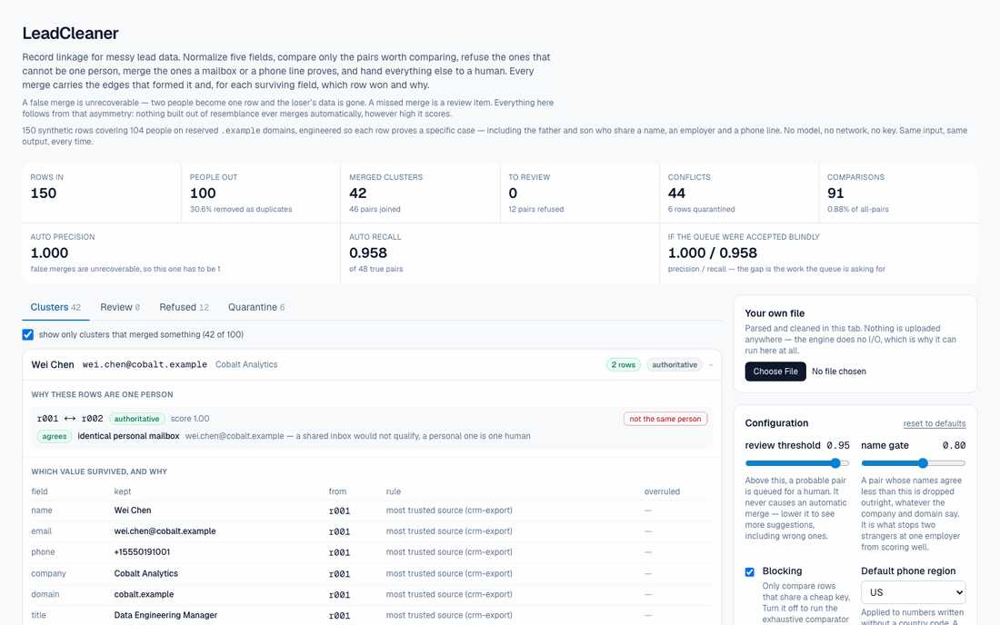
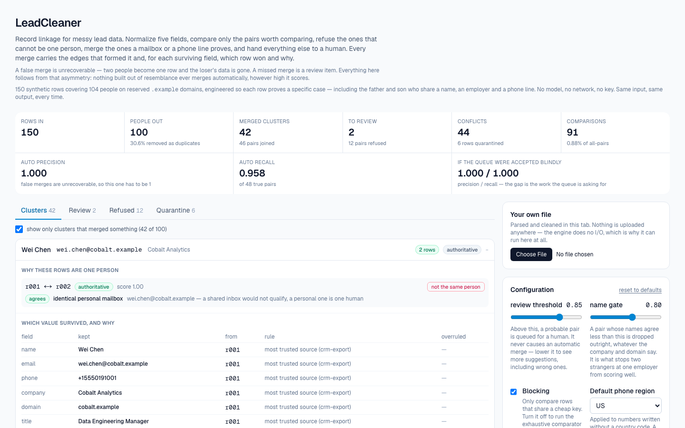
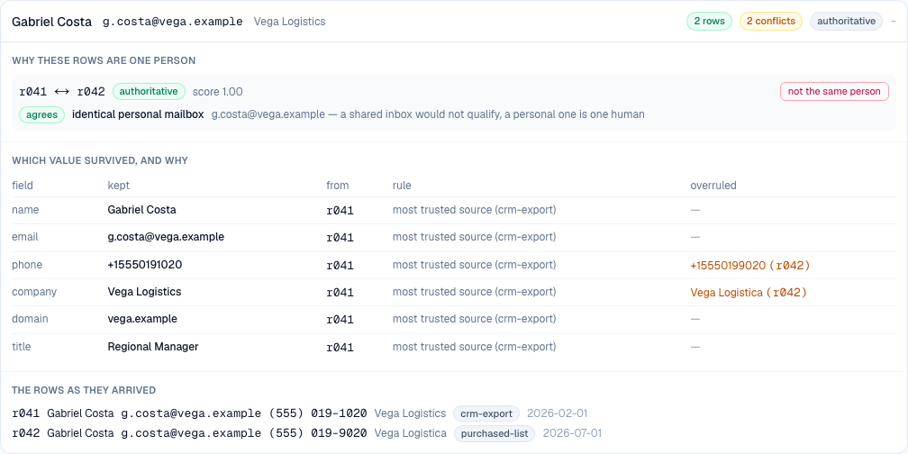
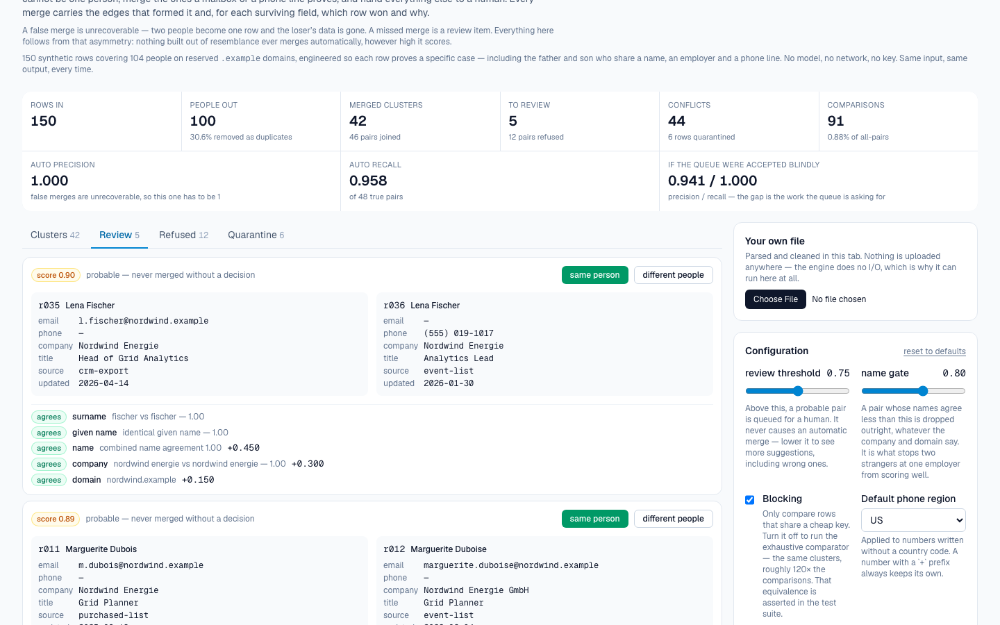
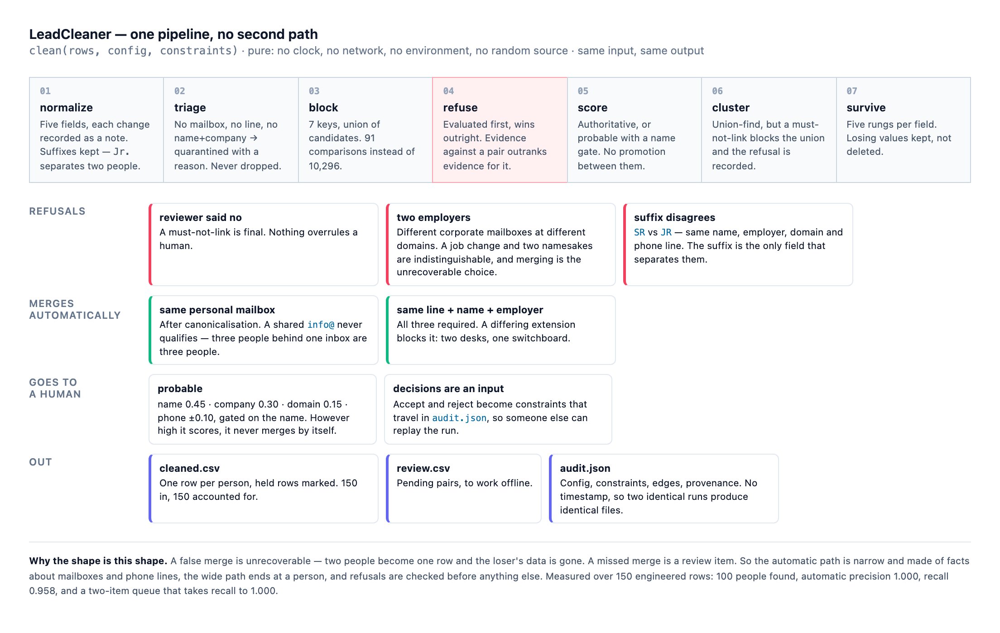

# LeadCleaner

Record linkage for messy lead and CRM data: tiered matching, constrained clustering, and a
field-level receipt for every merge.

[Live demo](https://lead-cleaner-smoky.vercel.app) · [Demo GIF](docs/demo.gif) · [Plain-English guide](docs/plain-english-guide.md)



## Why I Built This

Every CRM decays. The same human arrives three times — once from a webinar list as
`Bob Reyes / b.reyes+webinar@acme.example`, once from a form fill as `Robert Reyes / breyes@acme.example`,
once from a purchased list as `ROBERT REYES JR. / Acme, Inc.` with only a phone number. Reps work
all three. Sequences hit the same person twice. Territory counts are computed over a denominator
nobody trusts.

The tempting fix is a fuzzy-match button, and that fix is worse than the disease.

**A false merge is unrecoverable.** Two people become one row, the loser's email and history are
gone, and nobody notices for a year. A missed merge is an inconvenience someone can fix later. That
asymmetry is not a detail — it is the entire design:

- The automatic path is narrow and made of facts about **mailboxes and phone lines**, never about
  resemblance. There is no score at which two similar records merge by themselves.
- The wide path ends at a **human**, with the evidence laid out.
- **Refusals are evaluated first** and win outright, including over an otherwise-automatic merge.
- Every surviving field says which row won, which rung of the chain decided it, and **what lost**.

## What It Does

150 messy synthetic rows resolve to **100 people** with **zero false merges**, using **91
comparisons instead of 10,296**, and hand you a two-item queue that takes recall to 1.000.

Load it and the demo dataset is already there. Scan the merges, expand one to see why those rows are
one person, work the queue, check the quarantine bucket, export three files. Or drop in your own CSV —
it is parsed and cleaned in the browser tab and never leaves your machine.



## Demo

**Why these rows are one person, and which value survived.** Source trust beats recency here, and
both overruled values stay visible rather than being silently discarded:



**The review queue.** Both rows side by side, every scoring component with its weight, and two
buttons that record a constraint rather than mutating state:



## How It Works

```
parse → normalize → triage → block → refuse → score → constrain → cluster → survive → metrics
```

**1. Normalize** five fields — name, email, phone, company, domain — each transformation recorded as
a note in the words a user would use. Two decisions carry weight:

- Generational suffixes are **kept**. `Robert Reyes Sr.` and `Robert Reyes Jr.` are a father and son
  at one company, and the suffix is the only field in either row that says two people.
- `EmailKind` answers two questions that get conflated. *Does it identify a person?* `personal` and
  `freemail` both do — `bob@gmail.com` is one human's mailbox. *Does it identify a company?* Only
  `personal`. Let a consumer domain through as an employer and everyone with a personal address
  shares a company, while the match rules go on weighting domain equality heavily.

**2. Triage.** A row with no mailbox, no valid line, and no name-plus-company cannot be compared
against anything. It is quarantined **with a reason** and still appears in `cleaned.csv` marked as
held. Silently dropping rows is the worst thing a tool like this can do, because the loss is
invisible.

**3. Block.** Seven keys; a pair is compared if it shares any one of them. Each key is blind in a
different way, so the union covers what one alone would miss — a misspelled surname keeps its company
and its phone, a missing phone keeps its mailbox, the same name at two employers shares nothing but
the name.

**4. Refuse.** Three rules, evaluated before anything else:

| Rule | Why it is strong enough to override a merge |
|---|---|
| a reviewer's rejection | Nothing in the system overrules a human. |
| two corporate mailboxes at two employers | A job change and two people with one name are indistinguishable from the rows alone. Merging is the unrecoverable choice. |
| generational suffixes disagree | `SR` vs `JR`, sharing a name, an employer, a domain *and* the office line. |

**5. Score.** Two tiers, and nothing is ever promoted between them.

*Authoritative — merges without asking:*

| Rule | Requires |
|---|---|
| same personal mailbox | Identical after canonicalisation. A shared `info@` never qualifies: three people behind one inbox are three people. |
| same line + name + employer | All three. A *differing* extension blocks it — two desks on one switchboard. |

*Probable — goes to a human, however high it scores:*

| Component | Weight |
|---|---|
| name agreement (surname-weighted, nickname- and initial-aware) | 0.45 |
| company key similarity (order-insensitive token pairing) | 0.30 |
| domain equality | 0.15 |
| same subscriber number | +0.10 |
| two valid, different numbers | −0.10 |

Gated on the name: below `nameGate` the pair is dropped regardless of total, so nothing reaches
review on the strength of a shared employer.

**6. Cluster.** Union-find, with its transitivity hole closed. A union that would place a
must-not-link pair in one cluster does not happen, and the edge that proposed it is recorded as
refused — the audit trail has to explain the merge that *didn't* occur.

**7. Survive.** Five ordered rungs per field; the first that discriminates wins.

| | Rung |
|---|---|
| 1 | non-empty beats empty — a newer row that dropped a column must not erase it |
| 2 | valid beats invalid — a parsed E.164 over unparseable digits, a personal mailbox over a shared inbox |
| 3 | source trust, in the order you configure |
| 4 | recency |
| 5 | lowest row id — a deterministic tiebreak, so there is always an answer |

Recency sits *below* trust deliberately. "Newest wins" is the usual default and it is wrong for lead
data, where the newest touch is often a bought list overwriting the CRM record. Every losing value
that disagreed is kept: resolving a conflict silently is the same as deleting the loser.

## Architecture



```
data/leads.ts            150 engineered rows + truePersonId labels
lib/text/                similarity primitives, zero dependencies
  jaro-winkler.ts        typo tolerance with a prefix boost, for person names
  token-set.ts           order-insensitive token pairing, for company names
  phonetic.ts            Soundex, for blocking only
  nicknames.ts           Bob↔Robert, and why a name maps to a *set*
lib/normalize/           one module per field, each returning value + notes
lib/match/
  blocking.ts            seven keys; oversized blocks skipped and reported
  refuse.ts              the three rules, evaluated first
  rules.ts               the two tiers and the weighted sum
  cluster.ts             union-find honouring must-not-link
lib/survive/             the chain, conflicts, and provenance
lib/clean/run.ts         clean(rows, config, constraints) — the only pipeline
lib/csv/ lib/export/     parser, writer, and the three output files
app/                     the console; app/api/clean for scripting
scripts/sweep.ts         the calibration table below
```

**The engine is pure.** Nothing under `lib/` imports `next/*` or `node:*`, reads `process.env`, or
calls `fetch` / `Date.now` / `Math.random`. `lib/clean/purity.test.ts` enforces it by reading the
source. That is not hygiene — it is what lets the whole pipeline run in the browser, which is what
lets an uploaded CSV stay on the machine it came from.

**One orchestration path.** `clean()` is called by the browser, the API route, the sweep script and
every test. A second path would mean two answers to the same question.

**Constraints are an input, not UI state.** Review decisions arrive alongside the rows and config, so
the run stays reproducible by someone who wasn't in the room. They travel in `audit.json`, and a test
replays one end to end.

## Key Decisions & Tradeoffs

- **Decision:** no LLM anywhere in the path.
  **Why:** a model deciding whether two records are one person makes the result unreproducible and
  unauditable, and *deterministic workflows* is the point.
  **Tradeoff:** no semantic judgement on genuinely ambiguous names — those become review items.

- **Decision:** a probable match never merges automatically.
  **Why:** the asymmetry above.
  **Tradeoff:** recall depends on someone working the queue. Automatic recall is 0.958, not 1.0.

- **Decision:** refuse two corporate mailboxes at different employers.
  **Why:** merging costs a person's record; refusing costs a duplicate.
  **Tradeoff:** a real job change between corporate addresses is refused. This is the honest hard
  case in the project — a job change and two namesakes are the same rows.

- **Decision:** hand-written similarity, CSV parser and E.164 formatter; zero runtime dependencies.
  **Why:** these are the parts of a deduplicator worth reading, and the privacy claim is only as good
  as the code an uploaded file passes through.
  **Tradeoff:** the phone table covers 18 regions, not the world; Soundex is Anglocentric.

- **Decision:** blocking on by default.
  **Why:** 113× fewer comparisons.
  **Tradeoff:** recall risk — bounded by a test, not by a promise (below).

- **Decision:** quarantine rather than drop.
  **Why:** an invisible loss is worse than a visible one.
  **Tradeoff:** `cleaned.csv` contains rows that were not cleaned. They are labelled.

## Getting Started

### Prerequisites

Node 20+. Nothing else — no API key, no database, no environment variables.

### Installation

```bash
git clone https://github.com/akshatiwarix/lead-cleaner.git
cd lead-cleaner
npm install
```

### Run Locally

```bash
npm run dev      # http://localhost:3000, dataset already loaded
```

## Usage

Drag the **review threshold** and watch the queue and the precision figures move. Expand a cluster to
see its edges and provenance. Accept or reject a pair and watch the numbers change. Drop in your own
CSV — headers are auto-mapped and shown.

Programmatically:

```bash
curl -s localhost:3000/api/clean -H 'content-type: application/json' -d '{
  "csv": "name,email,phone,company\nBob Reyes,b.reyes@acme.example,(555) 019-2837,\"Acme, Inc.\"\nRobert Reyes,breyes@acme.example,555.019.2837,Acme Incorporated",
  "config": { "reviewThreshold": 0.8 }
}' | jq '.metrics'
```

## Validation / Testing

```bash
npm run typecheck && npm run lint && npm test    # the gate — 318 tests
npm run sweep                                    # the calibration table
```

Four tests carry the claims above. If one fails, the claim is false and the test is right.

| Test | Claim |
|---|---|
| `lib/clean/run.test.ts` | **Automatic precision is 1.0.** No two rows from different people share a cluster. |
| `lib/match/cluster.test.ts` | **Order independence.** Shuffled input produces byte-identical output, including under a constrained union where edge order would otherwise decide which of two conflicting merges wins. |
| `lib/match/blocking.test.ts` | **Blocking loses nothing.** Every pair the exhaustive comparator would merge or review is also reachable under blocking — plus every refusal that is actually preventing something. |
| `lib/clean/purity.test.ts` | **Purity.** No clock, network, environment or randomness anywhere under `lib/`. |

Plus: no row disappears (`rows in === clustered + quarantined`, asserted by id); the dataset contains
no real domain; `audit.json` replays to the same `runHash`.

### The calibration table

From `npm run sweep`, measured against the dataset's `truePersonId` labels. `auto` is what the engine
does alone; `blind` is what you get if a reviewer accepts the whole queue without looking.

| threshold | people | queue | auto P | auto R | blind P | blind R |
|---|---|---|---|---|---|---|
| 0.95 | 100 | 0 | 1.000 | 0.958 | 1.000 | 0.958 |
| 0.90 | 100 | 1 | 1.000 | 0.958 | 1.000 | 0.979 |
| **0.85** | **100** | **2** | **1.000** | **0.958** | **1.000** | **1.000** |
| 0.80 | 100 | 3 | 1.000 | 0.958 | 0.980 | 1.000 |
| 0.75 | 100 | 5 | 1.000 | 0.958 | 0.941 | 1.000 |
| 0.70 | 100 | 6 | 1.000 | 0.958 | 0.923 | 1.000 |
| 0.60 | 100 | 9 | 1.000 | 0.958 | 0.873 | 1.000 |

**0.85 ships** because it is the lowest threshold whose queue still contains only real duplicates:
two pairs to look at, and accepting both reaches perfect precision *and* perfect recall. Below it the
queue starts including pairs that must be rejected.

Read the `auto P` column down the page: **1.000 at every threshold**. That is not luck. The automatic
tier never consults the threshold — it merges on a shared mailbox or a shared line, never on a score —
so moving the slider cannot introduce a false merge. That is the whole architecture in one column.

Fixed at the defaults: 48 true pairs, 46 merged automatically, 6 rows quarantined, 44 fields with a
flagged conflict, 91 comparisons vs 10,296 exhaustive (**113×**, 0.88% of all pairs), and the two
modes produce identical clusters.

### The dataset

150 rows covering 104 people on reserved `.example` domains, every row annotated with what it proves.
The **hard negatives** are the point — a set of true duplicates scores 100% recall and proves nothing:

| Rows | The trap |
|---|---|
| Robert Reyes Sr. / Jr. | One company, one domain, one phone line. Authoritative on phone — the suffix has to override it. |
| Two Wei Chens at Apex | Nothing confirms or refutes the pair. A human decides. |
| Ana Silva / Bruno Alves | Byte-identical canonical email — a shared `info@`. The most common false merge in real CRM data. |
| Katherine Boyle / Miles Trenton | Identical E.164, different extensions. |
| Alexander / Alexandra Novak | 0.96 similar on Jaro-Winkler, same surname, same employer. |
| `J. Okafor` | The company employs a Jane *and* a John. The phone decides which. |
| Daniel Whitfield ×2 | Same name, two employers. |

## Limitations

- **English-biased naming.** Honorifics, suffixes and the nickname table are English; surname
  particles cover European conventions. Names outside them still match, just with less help.
- **No transliteration.** Diacritics are folded; scripts are not converted.
- **18 phone regions**, not libphonenumber. An unrecognised format is refused rather than guessed at.
- **Ambiguous dates are refused.** `03/04/2026` is two dates depending on who wrote the file, so the
  survivorship chain falls through instead of acting on a coin flip.
- **Blocking's recall is bounded on this dataset**, not proven in general. The exhaustive comparator
  is one checkbox away, and the equivalence is asserted.
- **A job change between two corporate addresses is refused**, by design and at a cost.
- **In memory only.** No persistence, no auth, no multi-user review. A file larger than memory will
  not load.
- **Titles get case and whitespace only** — seniority and function extraction belongs to a later day.

## What I'd Build Next

- Account-level dedup as a first-class product, with parent/subsidiary hierarchy.
- Learned weights: fit to the labels instead of hand-setting them, and publish a calibration curve.
- Incremental dedup — match a new batch against an existing clean base without re-running everything.
- Merge *undo*: replay the audit trail backwards.
- CRM writeback behind a dry-run diff.
- Streaming ingest for files too large for memory.

## License

MIT — see [LICENSE](LICENSE).

---

Day 003 of a 100-day building challenge. Day 001 was [icp-score](https://github.com/akshatiwarix/icp-score),
Day 002 was [enrichment-waterfall](https://github.com/akshatiwarix/enrichment-waterfall).
